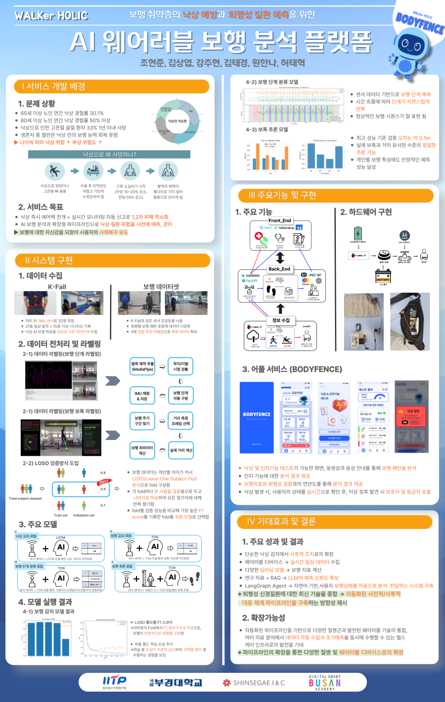

# WalkerHolic

## 개요 (Overview)

WalkerHolic은 사용자의 보행 분석을 통해 건강 상태를 진단하고 질병을 예측하는 AI 기반 헬스케어 애플리케이션입니다. 센서 데이터를 분석하여 보행 패턴을 파악하고, 의학적 진단과 개인화된 피드백을 제공합니다.

WalkerHolic is an AI-powered healthcare application that diagnoses health conditions and predicts diseases through gait analysis. It analyzes sensor data to identify walking patterns and provides medical diagnosis with personalized feedback.

## 프로젝트 상태 (Project Status)


## 비주얼/스크린샷 (Visuals/Screenshots)

여기에 프로젝트의 주요 화면 스크린샷이나 포스터 이미지를 추가할 수 있습니다.
You can add screenshots of key project screens or the poster image here.

예시 (Example):



## 시스템 아키텍처 (System Architecture)

### 백엔드 (Backend)

- **FastAPI 서버**: 비동기 API 서비스 제공
- **랭그래프 (LangGraph) 파이프라인**: 보행 데이터 처리, 분석 및 진단을 위한 노드 기반 워크플로우
- **텐서플로우 기반 TCN 모델**: 보행 패턴 분석 및 stride 예측
- **RAG (Retrieval-Augmented Generation)**: 의학 논문 기반 진단 생성

### 프론트엔드 (Frontend)

- **React**: 사용자 인터페이스 구현
- **Vite**: 빠른 개발 및 빌드 도구
- **Tailwind CSS**: 모던한 UI 스타일링

### 주요 기능 (Key Features)

1. **보행 분석 (Gait Analysis)**
   - 보행 패턴 감지 및 분석
   - 보행 점수 및 지표 계산
   - 비정상 보행 패턴 식별

2. **질병 예측 (Disease Prediction)**
   - 파킨슨병, 뇌졸중 후유증 등 질병 가능성 예측
   - 의학적 근거 기반 진단

3. **낙상 알림 (Fall Alert)**
   - 낙상 위험 감지 및 알림

4. **인지 테스트 (Cognitive Test)**
   - 인지 기능 평가

## 설치 및 실행 (Installation & Execution)

### 사전 요구사항 (Prerequisites)

- Python 3.8+ (백엔드)
- Node.js 16+ (프론트엔드)
- TensorFlow 2.8+ (모델 실행)

### 백엔드 설정 (Backend Setup)

1. 환경 설정:
```bash
# 가상환경 생성 및 활성화
python -m venv venv
source venv/bin/activate  # Windows: venv\Scripts\activate

# 의존성 설치
pip install -r requirements.txt
```

2. 서버 실행:
```bash
python fastapi_server.py
```

### 프론트엔드 설정 (Frontend Setup)

1. 의존성 설치:
```bash
cd front
npm install
```

2. 개발 모드 실행:
```bash
npm run dev
```

3. 빌드:
```bash
npm run build
```

## API 사용법 (API Usage)

### 보행 분석 API (Gait Analysis API)

#### 1. 보행 분석 요청
```http
POST /gait-analysis/langgraph-diagnosis
Content-Type: application/json

{
  "userInfo": {
    "name": "홍길동",
    "height": 175,
    "gender": "male"
  },
  "gaitData": {
    "walkingTime": 60,
    "steps": 120,
    "distance": 100
  },
  "timestamp": "2024-01-15T10:30:00Z"
}
```

#### 2. 진단 상태 확인
```http
GET /gait-analysis/diagnosis/status/{diagnosisId}
```

## 파일 구조 (File Structure)

```
WalkerHolic/
├── docs/                       # 문서 및 참고자료
├── fastapi_server.py           # FastAPI 서버 (백엔드 메인)
├── filter_walking_data.py      # 보행 데이터 필터링 유틸리티
├── front/                      # 프론트엔드 (React + Vite)
│   ├── src/
│   │   ├── components/         # UI 컴포넌트
│   │   ├── pages/              # 페이지 컴포넌트
│   │   ├── services/api/       # API 서비스
│   │   └── hooks/              # 커스텀 훅
├── langgraph_nodes/            # LangGraph 노드 구현
│   ├── ai_model_nodes.py       # AI 모델 노드
│   ├── data_processing_nodes.py # 데이터 처리 노드
│   ├── graph_state.py          # 그래프 상태 정의
│   ├── metrics_nodes.py        # 메트릭 계산 노드
│   ├── rag_diagnosis_nodes.py  # RAG 진단 노드
│   └── response_nodes.py       # 응답 포매팅 노드
├── metadata/                   # 정규화 통계 등 메타데이터
├── models_2/                   # 학습된 모델 파일
│   └── best_fold_*.keras       # 모델 파일 (K-fold cross-validation)
├── stage2_model.py             # 2단계 모델 구현
├── stage2_predictor.py         # 2단계 모델 예측기
├── stride_inference_pipeline.py # Stride 추론 파이프라인
└── tcn_model.py                # TCN 모델 정의
```

## 핵심 컴포넌트 (Core Components)

### 1. LangGraph 파이프라인 (Pipeline)

보행 분석 및 진단을 위한 노드 기반 워크플로우:

1. **ReceiveRequestNode**: 요청 수신 및 초기 상태 생성
2. **FileMetadataNode**: 파일 메타데이터 처리
3. **DownloadCsvNode**: CSV 데이터 다운로드
4. **FilterDataNode**: 데이터 필터링
5. **PredictPhasesNode**: 보행 단계 예측
6. **PredictStrideNode**: Stride 예측
7. **CalcMetricsNode**: 메트릭 계산
8. **ComposePromptNode**: RAG 프롬프트 작성
9. **RagDiagnosisNode**: RAG 기반 의학적 진단
10. **FormatResponseNode**: 최종 응답 포맷팅

### 2. 보행 분석 지표 (Gait Analysis Indicators)

- **Stride Length**: 보폭 길이
- **Stride Time**: 보폭 시간
- **Cadence**: 분당 걸음 수
- **Gait Symmetry**: 보행 대칭성
- **Step Width**: 보폭 너비
- **Walking Speed**: 보행 속도

## 개발자 가이드 (Developer Guide)

### 백엔드 래핑 가이드

자세한 내용은 `front/backend_wrapping_guide.md` 참조

### 모델 추가 방법

1. 새로운 모델 구현 (TensorFlow/Keras)
2. `tcn_model.py` 형식에 맞춰 구현
3. `langgraph_nodes/ai_model_nodes.py`에 노드 추가

### 프론트엔드 컴포넌트 추가

1. `front/src/components/` 디렉토리에 컴포넌트 추가
2. React 컴포넌트 구현
3. 필요한 페이지에 임포트하여 사용

## 라이선스 (License)

Copyright (c) 2024 WalkerHolic Team 
