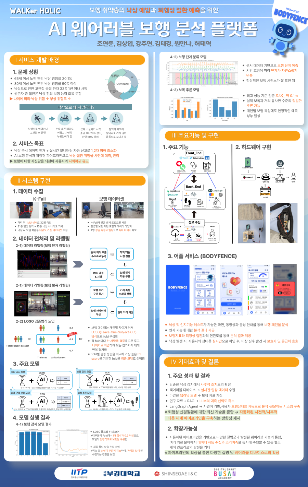

# WALKerHolic

## AI 웨어러블 보행 분석 플랫폼 (BODYFENCE)

> **IITP 프로젝트** | 팀명: WALKer HOLIC


---

## 📋 목차

1. [프로젝트 개요](#프로젝트-개요)
2. [프로젝트 포스터](#프로젝트-포스터)
3. [핵심 목표: 3단계 통합 솔루션](#핵심-목표-3단계-통합-솔루션)
4. [프로젝트 산출물](#프로젝트-산출물)
5. [기술적 수행 내용](#기술적-수행-내용)
6. [시스템 아키텍처](#시스템-아키텍처)
7. [주요 기능](#주요-기능)
8. [기술 스택](#기술-스택)
9. [설치 및 실행](#설치-및-실행)
10. [API 사용법](#api-사용법)
11. [파일 구조](#파일-구조)
12. [주요 성과](#주요-성과)
13. [확장 가능성](#확장-가능성)
14. [라이선스](#라이선스)

---

## 프로젝트 개요

### 배경 및 문제 인식

고령층에서 **낙상**은 매우 흔하게 발생하며, 낙상 이후 **2차 피해**(골절, 와상, 지연 구조)로 인한 사망과 사회적 비용이 심각한 문제로 대두되고 있습니다.

### 솔루션

WALKerHolic은 **착용형 센서(낙상 벨트)**와 **모바일 앱**, 그리고 **AI 분석**을 결합하여 고령층의 낙상 예방부터 사후 관리까지 **통합 안전관리 서비스**를 제공합니다.

- 🔔 **낙상 이전**: 위험 신호를 조기에 포착하고 경고
- 🚨 **낙상 발생**: 실시간 감지 후 보호자/119 자동 신고로 골든타임 확보
- 📊 **낙상 이후**: 보행 패턴 분석을 통한 맞춤형 재발 방지 가이드 제공

---

## 프로젝트 포스터



---

## 핵심 목표: 3단계 통합 솔루션

| 단계 | 목표 | 상세 설명 |
|:---:|:---:|---|
| **1단계** | 낙상 이전 | 일상 보행 데이터를 실시간 분석하여 **위험 신호를 조기에 포착**하고 사용자에게 경고합니다. |
| **2단계** | 낙상 발생 | 낙상 순간을 **실시간으로 감지**하여 보호자 및 119에 **자동 신고**, 골든타임을 확보합니다. |
| **3단계** | 낙상 이후 | 하루 보행 경로, 시간, 패턴을 분석하여 **개인 맞춤형 재발 방지 가이드**와 관리 리포트를 제공합니다. |

---

## 프로젝트 산출물

### 1. 낙상 감지 벨트 (하드웨어)

허리에 착용하는 **IMU 센서(가속도·자이로)** 기반 웨어러블 디바이스입니다.

| 기능 | 설명 |
|---|---|
| **실시간 움직임 수집** | IMU 센서로 사용자의 움직임을 실시간으로 수집합니다. |
| **온디바이스 낙상 판정** | 딥러닝 모델이 기기 내에서 직접 낙상 여부를 즉시 판정합니다. |
| **에어백 전개** | 낙상 판정과 동시에 에어백을 전개하여 요추 충격을 1차로 경감합니다. |
| **자동 알림 연계** | 이벤트를 앱으로 전송하여 보호자 알림과 119 신고를 자동 연계합니다. |
| **경량·저전력 설계** | 장시간 일상 착용이 가능하도록 설계되었습니다. |

### 2. 보행 분석·진단 앱 (소프트웨어)

벨트의 IMU 데이터를 받아 **딥러닝 모델**로 보행 단계와 보폭을 산출하고, **AI 기반 진단**을 제공하는 모바일 앱입니다.

| 기능 | 설명 |
|---|---|
| **보행 지표 산출** | IMU 데이터를 분석하여 보행 단계, 보폭 등 핵심 지표를 계산합니다. |
| **RAG 진단 파이프라인** | LangGraph 기반 RAG 진단 자동화 파이프라인으로 임상 문헌과 대조하여 분석합니다. |
| **진단 리포트 제공** | 위험도, 의심 패턴, 근거 요약이 포함된 리포트를 제공합니다. |
| **일일 통계** | 보행 경로, 시간, 패턴 통계를 제공합니다. |
| **위험 징후 알림** | 이상 징후 감지 시 즉시 알림을 보내고 보호자와 연결합니다. |

> ⚠️ **참고**: 본 서비스는 의료행위가 아닌 **정보 제공 및 모니터링 목적**입니다.

---

## 기술적 수행 내용

### 1. 데이터 수집

#### K-Fall 데이터셋 활용
- **센서**: 허리 착용 IMU (가속도·자이로)
- **참여자**: 32명
- **동작 종류**: 21종 일상 동작 + 15종 낙상 동작
- **용도**: 낙상/비낙상 기준 데이터 확보

#### 자체 보행 데이터셋 구축
- 동일 센서·포맷으로 실사용 환경에서 데이터 수집
- 영상 동기화 병행하여 정확도 향상

### 2. 데이터 전처리 및 라벨링

| 단계 | 수행 내용 |
|---|---|
| **1. 발목 관절 추출** | 영상에서 Mediapipe로 발목 관절을 추출하고 착지/이탈 시점을 검출합니다. |
| **2. 데이터 매칭** | IMU와 영상을 매칭·정렬하여 보행 단계를 자동 구분하고 보행 주기를 확정합니다. |
| **3. 파라미터 계산** | 대표 프레임을 선택해 보행 파라미터를 계산하고 실제 보폭을 산출합니다. |
| **4. 교차 검증 설계** | 개인차를 고려해 LOSO(Leave-One-Subject-Out)로 학습·검증 분할을 구성합니다. |

### 3. 모델 제작

#### 3.1 낙상 감지 분류 모델
- **입력**: IMU 센서 데이터 (가속도, 자이로)
- **출력**: 낙상 여부 (이진 분류)
- **특징**: 실시간 동작 가능하도록 경량화

#### 3.2 보행 단계 분류 모델
- **입력**: IMU 시계열 데이터
- **출력**: 보행 단계 (보행/비보행, 이중지지/단일지지)
- **특징**: 다중 클래스 분류

#### 3.3 보폭 예측 회귀 모델
- **입력**: 보행 1주기 IMU 데이터
- **출력**: 보폭 길이 (연속값)
- **특징**: 회귀 모델로 정밀한 보폭 예측

> 모든 모델은 **LOSO(Leave-One-Subject-Out)** 방식으로 학습 및 평가하여 개인차에 강건한 성능을 확보했습니다.

---

## 시스템 아키텍처

### 전체 구조

```
┌─────────────────┐    ┌─────────────────┐    ┌─────────────────┐
│   낙상 벨트      │    │   모바일 앱      │    │   백엔드 서버    │
│   (IMU 센서)    │───▶│   (React)       │───▶│   (FastAPI)     │
│                 │    │                 │    │                 │
│ • 가속도/자이로  │    │ • 데이터 시각화  │    │ • LangGraph     │
│ • 온디바이스 AI  │    │ • 실시간 알림    │    │ • TCN 모델      │
│ • 에어백 제어    │    │ • 리포트 표시    │    │ • RAG 진단      │
└─────────────────┘    └─────────────────┘    └─────────────────┘
```

### 백엔드 아키텍처

| 구성요소 | 설명 |
|---|---|
| **FastAPI 서버** | 비동기 API 서비스를 제공하는 메인 서버입니다. |
| **LangGraph 파이프라인** | 보행 데이터 처리, 분석, 진단을 위한 10개 노드 기반 워크플로우입니다. |
| **TensorFlow TCN 모델** | 시계열 데이터 분석을 위한 Temporal Convolutional Network 모델입니다. |
| **RAG 시스템** | 임상 문헌 기반 의학적 진단을 생성하는 Retrieval-Augmented Generation 시스템입니다. |

### 프론트엔드 아키텍처

| 구성요소 | 설명 |
|---|---|
| **React** | 사용자 인터페이스를 구현하는 프레임워크입니다. |
| **Vite** | 빠른 개발 및 빌드를 위한 도구입니다. |
| **Tailwind CSS** | 모던한 UI 스타일링을 위한 CSS 프레임워크입니다. |
| **Supabase Realtime** | 낙상 감지 실시간 알림을 위한 WebSocket 기반 서비스입니다. |

### LangGraph 파이프라인 노드

보행 분석 및 진단을 위한 **10단계 노드 기반 워크플로우**입니다:

```
┌─────────────┐   ┌─────────────┐   ┌─────────────┐   ┌─────────────┐
│ 1. Receive  │──▶│ 2. File     │──▶│ 3. Download │──▶│ 4. Filter   │
│    Request  │   │    Metadata │   │    CSV      │   │    Data     │
└─────────────┘   └─────────────┘   └─────────────┘   └─────────────┘
                                                             │
                                                             ▼
┌─────────────┐   ┌─────────────┐   ┌─────────────┐   ┌─────────────┐
│ 8. Compose  │◀──│ 7. Calc     │◀──│ 6. Predict  │◀──│ 5. Predict  │
│    Prompt   │   │    Metrics  │   │    Stride   │   │    Phases   │
└─────────────┘   └─────────────┘   └─────────────┘   └─────────────┘
       │
       ▼
┌─────────────┐   ┌─────────────┐
│ 9. RAG      │──▶│ 10. Format  │──▶ 최종 결과
│    Diagnosis│   │     Response│
└─────────────┘   └─────────────┘
```

| 순서 | 노드 | 역할 |
|:---:|---|---|
| 1 | **ReceiveRequestNode** | 요청 수신 및 초기 상태 생성 |
| 2 | **FileMetadataNode** | 파일 메타데이터 처리 |
| 3 | **DownloadCsvNode** | CSV 데이터 다운로드 |
| 4 | **FilterDataNode** | 보행 데이터 필터링 |
| 5 | **PredictPhasesNode** | 보행 단계 예측 (TCN 모델) |
| 6 | **PredictStrideNode** | 보폭 예측 (회귀 모델) |
| 7 | **CalcMetricsNode** | 보행 지표 계산 |
| 8 | **ComposePromptNode** | RAG 프롬프트 작성 |
| 9 | **RagDiagnosisNode** | RAG 기반 의학적 진단 생성 |
| 10 | **FormatResponseNode** | 최종 응답 포맷팅 |

---

## 주요 기능

### 1. 보행 분석

사용자의 보행 패턴을 분석하여 다양한 지표를 제공합니다.

| 지표 | 설명 | 정상 범위 |
|---|---|---|
| **보폭 시간 (Stride Time)** | 한쪽 발이 땅에 닿은 후, 같은 발이 다시 닿을 때까지의 시간 | 1.0~1.2초 |
| **양발 지지 비율 (Double Support)** | 두 발이 동시에 땅에 닿아 있는 시간의 비율 | 20~30% |
| **양발 보폭 차이 (Stride Difference)** | 왼발과 오른발의 걸음 길이 차이 | 5% 이하 |
| **평균 보행 속도 (Walking Speed)** | 단위 시간당 이동 거리 | 1.0~1.4 m/s |

### 2. 질병 예측

보행 패턴 분석을 통해 다음 질병의 위험도를 예측합니다:

| 질병 | 주요 지표 | 설명 |
|---|---|---|
| **파킨슨병** | 보폭 감소, 보행 속도 저하, 동결 보행 | 도파민 신경세포 손상으로 인한 운동 장애 |
| **뇌졸중 후유증** | 보행 비대칭, 편측 보폭 차이 | 뇌혈관 질환 후 나타나는 보행 이상 |

### 3. 낙상 감지 및 알림

**Supabase Realtime**을 활용한 실시간 낙상 감지 시스템입니다.

```
낙상 발생 → 벨트 감지 → 앱 알림 → 보호자/119 자동 연락
     │           │           │              │
  0.1초       0.5초       1초           5초 이내
```

- **실시간 감지**: 낙상 발생 즉시 앱에 알림
- **자동 연락**: 설정된 보호자 번호로 자동 전화 연결
- **119 신고**: 응답 없을 시 자동 119 신고

### 4. 인지 기능 테스트

간단한 인지 기능 평가를 통해 전반적인 건강 상태를 확인합니다.

---

## 기술 스택

### 백엔드

| 기술 | 버전 | 용도 |
|---|---|---|
| Python | 3.12+ | 메인 개발 언어 |
| FastAPI | 0.100+ | 비동기 웹 프레임워크 |
| TensorFlow | 2.8+ | 딥러닝 모델 |
| LangGraph | - | AI 워크플로우 파이프라인 |
| LangChain | - | LLM 연동 및 RAG |
| OpenAI API | GPT-4o-mini | 의학적 진단 생성 |

### 프론트엔드

| 기술 | 버전 | 용도 |
|---|---|---|
| React | 18+ | UI 프레임워크 |
| Vite | 5+ | 빌드 도구 |
| Tailwind CSS | 3+ | 스타일링 |
| Supabase | - | 실시간 알림 (Realtime) |

### 인프라

| 기술 | 용도 |
|---|---|
| Docker | 컨테이너화 |
| Docker Compose | 멀티 컨테이너 관리 |

---

## 설치 및 실행

### 사전 요구사항

#### Docker 사용 시 (권장)

- **Docker Desktop** 설치 필요
  - Windows: [Docker Desktop for Windows](https://docs.docker.com/desktop/install/windows-install/)
  - Mac: [Docker Desktop for Mac](https://docs.docker.com/desktop/install/mac-install/)
  - Linux: [Docker Engine](https://docs.docker.com/engine/install/)

#### 로컬 개발 시

- **Python 3.12+** (백엔드)
- **Node.js 16+** (프론트엔드)
- **npm** 또는 **yarn**

---

### 1단계: 프로젝트 클론

```bash
git clone https://github.com/your-username/WalkerHolic.git
cd WalkerHolic
```

---

### 2단계: 환경 변수 설정 (필수)

#### 백엔드 환경 변수 (.env)

프로젝트 루트에 `.env` 파일을 생성합니다:

```bash
# 프로젝트 루트에 .env 파일 생성
touch .env  # Linux/Mac
# 또는 Windows에서 직접 파일 생성
```

`.env` 파일 내용:

```env
# OpenAI API 설정 (필수)
OPENAI_API_KEY=sk-your-openai-api-key-here
OPENAI_MODEL=gpt-4o-mini
OPENAI_TEMPERATURE=0.1

# Supabase 설정 (필수 - 백엔드용)
SUPABASE_URL=https://your-project-id.supabase.co
SUPABASE_SERVICE_ROLE_KEY=your-service-role-key-here
```

> ⚠️ **주의**: `SUPABASE_SERVICE_ROLE_KEY`는 백엔드 전용입니다. 프론트엔드에서 사용하면 안 됩니다!

#### 프론트엔드 환경 변수 (front/.env)

`front/` 디렉토리에 `.env` 파일을 생성합니다:

```bash
# front 디렉토리로 이동
cd front

# .env 파일 생성
touch .env  # Linux/Mac
```

`front/.env` 파일 내용:

```env
# API 설정
VITE_API_BASE_URL=http://localhost:8000

# Supabase 설정 (필수 - 낙상 감지 알림용)
VITE_SUPABASE_URL=https://your-project-id.supabase.co
VITE_SUPABASE_ANON_KEY=your-anon-public-key-here
```

> ⚠️ **중요**: 프론트엔드에서는 반드시 `anon public` 키를 사용해야 합니다!

#### Supabase 키 확인 방법

1. [Supabase 대시보드](https://supabase.com/dashboard) 접속
2. 프로젝트 선택 → **Settings** → **API**
3. **Project URL** → `SUPABASE_URL` / `VITE_SUPABASE_URL`에 사용
4. **anon public** 키 → `VITE_SUPABASE_ANON_KEY`에 사용 (프론트엔드)
5. **service_role** 키 → `SUPABASE_SERVICE_ROLE_KEY`에 사용 (백엔드 전용)

---

### 3단계: Docker로 실행 (권장)

#### 모든 서비스 한 번에 실행

```bash
# 프로젝트 루트에서 실행
cd WalkerHolic

# 1. 이미지 빌드 및 서비스 시작
docker-compose up -d --build

# 2. 서비스 상태 확인
docker-compose ps

# 3. 로그 확인 (모든 서비스)
docker-compose logs -f

# 4. 특정 서비스 로그만 확인
docker-compose logs -f walkerholic-backend   # 백엔드 로그
docker-compose logs -f walkerholic-frontend  # 프론트엔드 로그
```

#### 서비스 중지

```bash
# 서비스 중지 (컨테이너 유지)
docker-compose stop

# 서비스 중지 및 컨테이너 삭제
docker-compose down

# 서비스 중지 + 볼륨까지 삭제 (데이터 초기화)
docker-compose down -v
```

#### 개별 서비스 실행

```bash
# 백엔드만 실행
docker-compose up -d walkerholic-backend

# 프론트엔드만 실행
docker-compose up -d walkerholic-frontend

# 특정 서비스 재빌드 (코드 변경 후)
docker-compose build --no-cache walkerholic-frontend
docker-compose up -d walkerholic-frontend
```

---

### 4단계: 접속 확인

서비스가 정상적으로 실행되면 다음 주소로 접속할 수 있습니다:

| 서비스 | URL | 설명 |
|---|---|---|
| **프론트엔드** | http://localhost:5173 | 메인 앱 화면 |
| **백엔드 API 문서** | http://localhost:8000/docs | Swagger UI (API 테스트) |
| **백엔드 Health Check** | http://localhost:8000/api/v1/health | 서버 상태 확인 |

---

### 로컬 개발 환경 (선택)

Docker 없이 로컬에서 직접 실행하려면:

#### 백엔드 실행

```bash
# 가상환경 생성 (Python 3.12 필요)
py -3.12 -m venv venv

# 가상환경 활성화
# Windows:
venv\Scripts\activate
# Linux/Mac:
source venv/bin/activate

# 의존성 설치
pip install -r requirements_core.txt

# 서버 실행
python fastapi_server.py
```

#### 프론트엔드 실행

```bash
# front 디렉토리로 이동
cd front

# 의존성 설치
npm install

# 개발 서버 실행
npm run dev
```

---

## API 사용법

### 보행 분석 요청

#### 1. 진단 시작

```http
POST /gait-analysis/langgraph-diagnosis
Content-Type: application/json

{
  "userInfo": {
    "name": "홍길동",
    "height": 175,
    "gender": "male"
  },
  "gaitData": {
    "walkingTime": 60,
    "steps": 120,
    "distance": 100
  },
  "timestamp": "2024-01-15T10:30:00Z"
}
```

**응답 예시:**

```json
{
  "success": true,
  "data": {
    "diagnosisId": "diag_12345678"
  }
}
```

#### 2. 진단 상태 확인

```http
GET /gait-analysis/diagnosis/status/{diagnosisId}
```

**응답 예시 (진행 중):**

```json
{
  "status": "processing",
  "progress": 45,
  "message": "보행 단계 예측 중..."
}
```

**응답 예시 (완료):**

```json
{
  "status": "completed",
  "progress": 100,
  "result": {
    "score": 85,
    "riskLevel": "정상 단계",
    "indicators": [...],
    "diseases": [...],
    "detailedReport": {...}
  }
}
```

---

## 파일 구조

```
WalkerHolic/
├── 📁 docs/                        # 문서 및 참고자료
├── 📁 front/                       # 프론트엔드 (React + Vite)
│   ├── 📁 src/
│   │   ├── 📁 components/          # UI 컴포넌트
│   │   │   ├── 📁 common/          # 공통 컴포넌트 (버튼, 알림 등)
│   │   │   └── 📁 gait/            # 보행 분석 관련 컴포넌트
│   │   ├── 📁 pages/               # 페이지 컴포넌트
│   │   │   ├── SplashPage.jsx      # 스플래시 화면
│   │   │   ├── LoginPage.jsx       # 로그인 화면
│   │   │   ├── MainPage.jsx        # 메인 화면
│   │   │   ├── GaitAnalysisPage.jsx # 보행 분석 화면
│   │   │   └── CognitiveTestPage.jsx # 인지 테스트 화면
│   │   ├── 📁 services/            # API 서비스
│   │   │   ├── 📁 api/             # API 호출 함수
│   │   │   └── supabaseClient.js   # Supabase 클라이언트
│   │   └── 📁 hooks/               # 커스텀 훅
│   │       └── useFallAlert.js     # 낙상 감지 훅
│   ├── 📄 Dockerfile               # 프론트엔드 Docker 설정
│   ├── 📄 .dockerignore            # Docker 빌드 제외 파일
│   └── 📄 .env                     # 환경 변수 (직접 생성 필요)
│
├── 📁 langgraph_nodes/             # LangGraph 노드 구현
│   ├── 📄 graph_state.py           # 그래프 상태 정의
│   ├── 📄 base_node.py             # 기본 노드 클래스
│   ├── 📄 data_processing_nodes.py # 데이터 처리 노드
│   ├── 📄 ai_model_nodes.py        # AI 모델 노드
│   ├── 📄 metrics_nodes.py         # 메트릭 계산 노드
│   ├── 📄 rag_diagnosis_nodes.py   # RAG 진단 노드
│   └── 📄 response_nodes.py        # 응답 포매팅 노드
│
├── 📁 models_2/                    # 학습된 모델 파일
│   └── 📄 best_fold_*.keras        # K-fold 교차 검증 모델
│
├── 📁 metadata/                    # 정규화 통계 등 메타데이터
│
├── 📄 fastapi_server.py            # FastAPI 서버 (백엔드 메인)
├── 📄 tcn_model.py                 # TCN 모델 정의
├── 📄 stage2_model.py              # 2단계 모델 구현
├── 📄 stage2_predictor.py          # 2단계 모델 예측기
├── 📄 stride_inference_pipeline.py # Stride 추론 파이프라인
├── 📄 filter_walking_data.py       # 보행 데이터 필터링
│
├── 📄 Dockerfile                   # 백엔드 Docker 설정
├── 📄 docker-compose.yml           # Docker Compose 설정
├── 📄 .dockerignore                # Docker 빌드 제외 파일
├── 📄 .env                         # 환경 변수 (직접 생성 필요)
├── 📄 requirements_core.txt        # 핵심 의존성 패키지
└── 📄 requirements.txt             # 전체 의존성 패키지
```

---

## 주요 성과

### 1. 통합 흐름 구현

본 프로젝트는 **'낙상 감지'**에 머물지 않고, 낙상 발생 직후 **자동 알림·신고** 등 **사후 조치**까지 아우르는 **통합 흐름**으로 기능을 확장했습니다.

### 2. 근거 중심 진단 시스템

- 허리 착용형 웨어러블이 **일상 데이터를 실시간 수집**
- 딥러닝 모델이 **보행 단계와 보폭 등 핵심 지표**를 산출
- 산출값과 시계열 패턴은 **연구 자료와 결합한 RAG 지식베이스**로 전달
- **LLM의 판단이 근거 중심**으로 이뤄지도록 예측 신뢰도 확보

### 3. 자동 분석 및 대응 시스템

- **LangGraph 에이전트**가 사용자 보행 상태를 **자연어로 자동 분석·전달**
- 위험 징후가 감지되면 **즉시 대응 절차를 트리거**

### 4. 퇴행성 신경질환 대응

- 파킨슨병, 뇌졸중 후유증 등 **퇴행성 신경질환 대응**까지 포괄 가능한 **"사전·사후 자동 대응 파이프라인"**의 실현 가능성과 방향성을 제시

---

## 확장 가능성

### 모듈화된 아키텍처

구축된 자동화 파이프라인은 **센서·모델·지식베이스가 모듈화**되어 있어 다양한 확장이 가능합니다.

| 확장 방향 | 설명 |
|---|---|
| **다양한 질병군** | 현재 파킨슨병, 뇌졸중 외에 다른 질병으로 확장 가능 |
| **다양한 웨어러블** | 다른 형태의 센서 및 디바이스 연동 가능 |
| **데이터 자동 수집** | 동일한 흐름으로 새로운 데이터 자동 수집 |
| **조기 예측** | 수집된 데이터 기반 조기 예측 모델 추가 |
| **개인 맞춤 위험도** | 개인별 맞춤 위험도 산정 시스템 |
| **재활 코칭** | 재활 운동 가이드 및 코칭 기능 연계 |
| **원격 모니터링** | 보호자 및 의료진을 위한 원격 모니터링 체계 |

---

## 라이선스

이 프로젝트는 **MIT 라이선스** 하에 배포됩니다.

```
MIT License

Copyright (c) 2024 WALKer HOLIC Team

Permission is hereby granted, free of charge, to any person obtaining a copy
of this software and associated documentation files (the "Software"), to deal
in the Software without restriction, including without limitation the rights
to use, copy, modify, merge, publish, distribute, sublicense, and/or sell
copies of the Software, and to permit persons to whom the Software is
furnished to do so, subject to the following conditions:

The above copyright notice and this permission notice shall be included in all
copies or substantial portions of the Software.

THE SOFTWARE IS PROVIDED "AS IS", WITHOUT WARRANTY OF ANY KIND, EXPRESS OR
IMPLIED, INCLUDING BUT NOT LIMITED TO THE WARRANTIES OF MERCHANTABILITY,
FITNESS FOR A PARTICULAR PURPOSE AND NONINFRINGEMENT. IN NO EVENT SHALL THE
AUTHORS OR COPYRIGHT HOLDERS BE LIABLE FOR ANY CLAIM, DAMAGES OR OTHER
LIABILITY, WHETHER IN AN ACTION OF CONTRACT, TORT OR OTHERWISE, ARISING FROM,
OUT OF OR IN CONNECTION WITH THE SOFTWARE OR THE USE OR OTHER DEALINGS IN THE
SOFTWARE.
```

---

<p align="center">
  <strong>WALKer HOLIC</strong> - 고령층을 위한 AI 보행 분석 플랫폼
</p>
